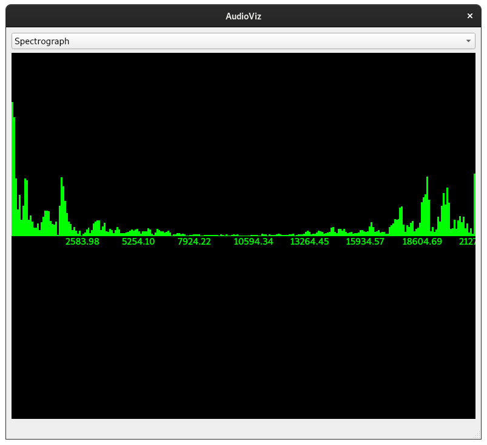

# audioviz
A visualizer for audio input, written by Benjamin Cottrell. Uses Qt 5 for the GUI, fftw3 for computing the FFT, and rtaudio to record audio.

## Building
### GNU/Linux
Building has been done on Debian 11. Change RTAUDIO_PATH in CMakeLists.txt to the path where the rtaudio git repository was cloned to.

On Debian, make sure the fftw3 library is installed with the package `libfftw3-dev`, and Qt 5 development files are installed with `qtbase5-dev`

To build, first get cmake to generate the build files, and then build it:

```
cmake -B build
cmake --build build -- -j6
```